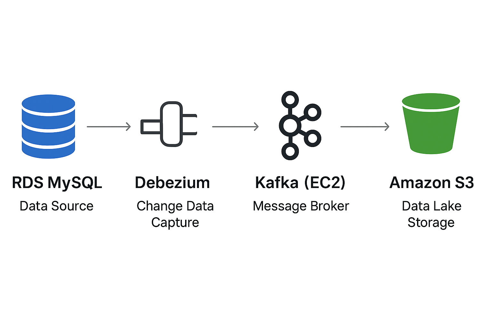

# MySQL RDS to S3 using Kafka (CDC Pipeline)

This project implements a real-time CDC pipeline that captures changes from a MySQL RDS database, streams them via Kafka hosted on EC2, and stores them in Amazon S3 using the Kafka S3 Sink Connector. It provides durable, near real-time data for analytics or downstream processing.

---

## Technologies Used
- **MySQL (AWS RDS):** Source database  
- **Debezium MySQL Connector:** Captures CDC events from MySQL  
- **Apache Kafka (EC2):** Message broker to transport events  
- **Kafka Connect:** Runs Debezium and S3 Sink connectors  
- **Kafka S3 Sink Connector:** Streams Kafka topic data into S3  
- **Amazon S3:** Data lake storage for CDC events  
- **EC2:** Hosting Kafka cluster and connectors  
- **Snowflake (Optional):** Data warehouse for analytics  

---

##  Workflow

1. **MySQL (RDS) Setup**  
   - Hosted in **Amazon RDS**.  
   - Contains the database and tables that will be tracked for changes (CDC).  
   - Configured with a **Custom DB Parameter Group** to enable binlog settings for Debezium:  
     - `binlog_format = ROW`  
     - `binlog_row_image = FULL`    
   - These settings ensure that row-level changes are captured correctly.

2. **Apache Kafka (EC2-hosted)**  
   - Acts as the **event streaming backbone**.  
   - Hosted on an **EC2 instance**.  
   - Receives CDC events from MySQL via **Debezium MySQL connector**.  
   - Separate **Kafka topics** are created for each MySQL table being monitored.  


3. **Debezium MySQL Source Connector**  
   - Runs on Kafka Connect (EC2).  
   - Captures changes from MySQL tables and publishes them to respective Kafka topics.  
   - **Configuration file:** [`mysql_connector.json`](./mysql_connector.json)  
   - **Register the connector with Kafka Connect:**  
     ```bash
     curl -X POST -H "Content-Type: application/json" \
     --data @mysql_connector.json \
     http://<KAFKA_CONNECT_HOST>:8083/connectors
     ```

   


4. **Kafka S3 Sink Connector**  
   - Streams CDC events from Kafka topics into Amazon S3.  
   - Supports JSON, Parquet, or CSV formats based on configuration.  
   - Ensures a durable, queryable data lake for downstream analytics.  
   - **Configuration file :** [`sink_connector_cdc.json`](./sink_connector_cdc.json)  
   - **Register the connector with Kafka Connect:**  
     ```bash
     curl -X POST -H "Content-Type: application/json" \
     --data @sink_connector_cdc.json \
     http://<KAFKA_CONNECT_HOST>:8083/connectors
     ```


5. **Amazon S3 (Data Lake)**  
   - Stores CDC events from Kafka in your chosen format.  
   - Allows batch or streaming analytics on stored events.


## 🔹 Architecture Diagram



## Conclusion

This project demonstrates a **fully cloud-based CDC pipeline** using MySQL, Kafka, and Amazon S3. By leveraging **Debezium** and the **Kafka S3 Sink Connector**, changes in the database are captured in near real-time, stored durably in S3, and can be ingested into **Snowflake** for analytics.  

This architecture ensures:
- **Real-time change capture** from MySQL.  
- **Durable storage** of events in S3.  
- **Scalability** via Kafka topics and connectors.  
- **Flexibility** for downstream analytics using Snowflake or other tools.
